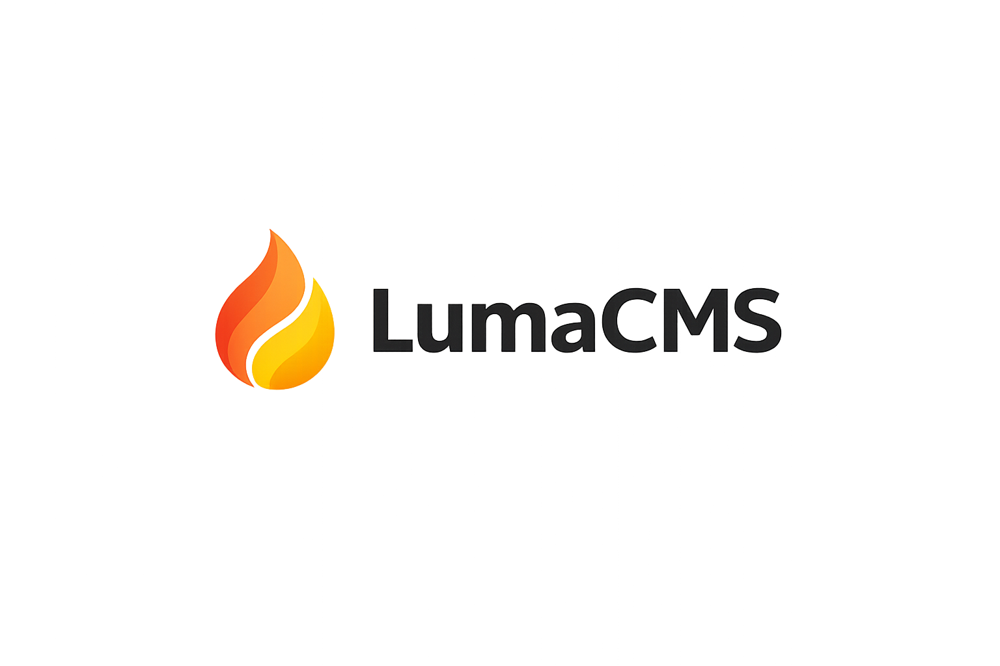

<p align="center">
  
</p>

# Luma CMS

Open-source CMS for developers, agencies, and SMB — structured content, clean Laravel architecture, and Luma Studio admin.

> **Status: Pre-alpha `[0.0.24]`.** Content Core through Integrations (Phase 6), production installer (Phase 7), and web setup / onboarding / shared-hosting updates (Phase 8) are implemented.

[](https://github.com/suprun-bohdan/luma-cms/actions/workflows/php.yml)
[](https://github.com/suprun-bohdan/luma-cms/actions/workflows/studio.yml)

## What is Luma CMS?

Luma CMS is a modular content platform — **not** a WordPress clone. Small core, structured content (collections → fields → entries), secure extensions, and developer-first APIs.

**Target wedge:** fast business websites with structured content, visual page editing, integrations, and clean extensibility.

## Core principles

- **Small core** — official features live in modules
- **Structured content** — collections, fields, entries; not raw HTML as source of truth
- **Modular monolith** — Core, modules, versioned API, Luma Studio
- **Secure extensions** — RBAC + plugin capabilities; manifest-driven lifecycle (Phase 5 MVP)
- **Versioned API** — REST under `/api/v1/`
- **Engineering discipline** — Actions, Policies, Form Requests, API Resources, feature tests

## Current progress

| Area | Status |
|------|--------|
| Monorepo (`apps/`, `packages/`) | Done |
| Laravel API — auth (Sanctum + RBAC) | Done |
| Collections / Fields / Entries API | Done |
| Draft / publish + public read API | Done |
| CI — PHP + Studio (GitHub Actions & GitLab CI) | Done |
| React Studio (`apps/studio/`) | Done (content admin, setup, onboarding, settings) |
| Media Core (API + Studio) | Done |
| Pages + Navigation (Phase 3.1) | Done |
| Business Website Kit (Phase 3.2) | Done |
| SEO infrastructure (Phase 3.3) | Done |
| Forms module (Phase 3.4) | Done |
| Visual editing MVP (Phase 4) | Done |
| Visual editor polish (Phase 4.3) | Done |
| Plugin foundation (Phase 5 MVP) | Done |
| Plugin extensibility (Phase 5.1) | Done |
| Plugin block registration (Phase 5.2) | Done |
| Integrations core (Phase 6) | Done |
| Installer + production Docker (Phase 7) | Done |
| Web installer, settings, onboarding, shared hosting (Phase 8) | Done |

Details: [CHANGELOG.md](CHANGELOG.md) · [apps/api/README.md](apps/api/README.md) · [apps/studio/README.md](apps/studio/README.md) · [plugins/README.md](plugins/README.md)

## API overview (pre-alpha)

Public (no auth):

```http
GET  /api/v1/health
GET  /api/v1/system/version
GET  /api/v1/system/requirements
GET  /api/v1/setup/status
POST /api/v1/auth/login
GET  /api/v1/public/collections/{slug}/entries
GET  /api/v1/public/entries/{id}
GET  /api/v1/public/media/{uuid}
GET  /api/v1/public/pages/{slug}
```

Authenticated (`Authorization: Bearer {token}`) — collections, fields, entries, media, pages, forms, plugins, integrations, settings, onboarding. See [apps/api/README.md](apps/api/README.md) for the full list and examples.

## Repository layout

```text
luma-cms/
  apps/
    api/          # Laravel 13 backend
    studio/       # React + TypeScript admin
  plugins/        # Internal plugins (luma.plugin.json + backend entrypoint)
  packages/
    sdk/          # Public TypeScript SDK (planned)
    plugin-sdk/   # Plugin development kit (planned)
    ui/           # Shared UI components (planned)
  deploy/         # Sample nginx / Apache configs for shared hosting
  INSTALL.txt     # Shared-hosting install checklist
  .github/workflows/
    php.yml       # Laravel: Composer + PHPUnit
    studio.yml    # Studio: npm lint + production build
  .gitlab-ci.yml  # PHP test + Studio build (path-filtered)
```

## Local development

This repo is the product source. An optional outer workspace with Docker/Nginx may be used locally — not required to hack on the code.

**API** (with Docker on port 8080):

```bash
# migrate + seed (first time)
docker compose exec php bash -c "cd apps/api && php artisan migrate && php artisan db:seed"

curl http://localhost:8080/api/v1/health
```

**API tests:**

```bash
docker compose exec php bash -c "cd apps/api && php artisan test"
```

**Studio:**

```bash
cd apps/studio && npm install && npm run dev
```

Open http://localhost:5173 (proxies `/api` when the backend is running).

**Studio lint + build** (same as CI):

```bash
cd apps/studio && npm run lint && npm run build
```

## Continuous integration

| Pipeline | Trigger paths | Steps |
|----------|---------------|--------|
| [PHP](.github/workflows/php.yml) | `apps/api/**` | PHP 8.4, `composer install`, `php artisan test` |
| [Studio](.github/workflows/studio.yml) | `apps/studio/**` | Node 22, `npm ci`, `npm run lint`, `npm run build` |

GitLab CI runs the same jobs via [`.gitlab-ci.yml`](.gitlab-ci.yml) (`build`/`test` for API, `studio:build` for Studio).

## Production & shared hosting

**Docker prod** (optional outer workspace):

```bash
make prod-setup   # PostgreSQL + luma:install + Luma Studio at /admin/
make update       # luma:update --force after a release upgrade
```

**Shared hosting:** extract release zip (vendor + `studio/dist` included), copy `apps/api/.env.shared.example` → `.env`, open `/admin/setup`. See [INSTALL.txt](INSTALL.txt) and [deploy/](deploy/).

After replacing release files via FTP, run database migrations from Studio → **Settings → Release updates** or `php artisan luma:update --force`.

## Contributing

See [CONTRIBUTING.md](CONTRIBUTING.md), [SECURITY.md](SECURITY.md), and [CODE_OF_CONDUCT.md](CODE_OF_CONDUCT.md).

## License

[MIT License](LICENSE)
